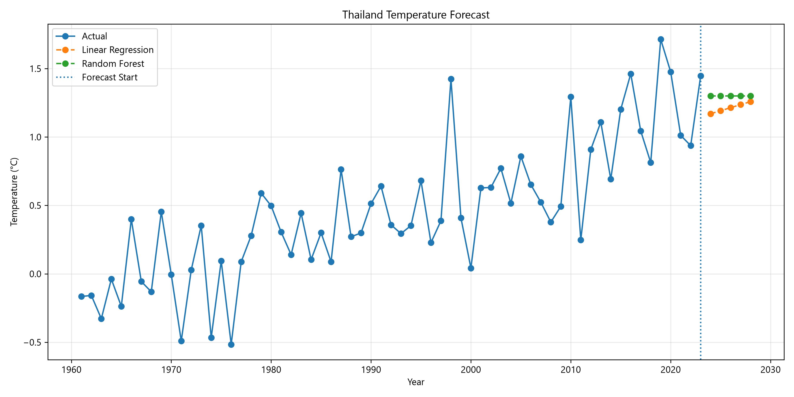
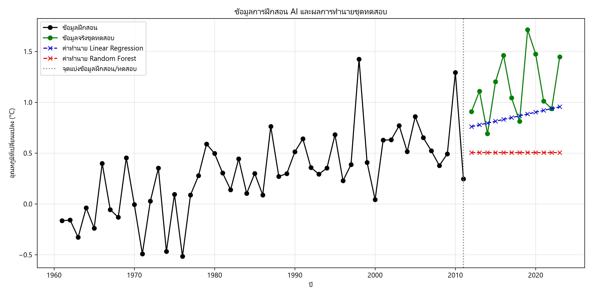

# Thailand Temperature Change Forecasting

> A student Data Mining / Machine Learning project for preparing Thailand temperature-change data and generating a five-year forecast.

[](https://www.python.org/)
[](https://pandas.pydata.org/)
[](https://scikit-learn.org/)

## Table of Contents

- [Project Overview](#project-overview)
- [Objectives](#objectives)
- [Repository Structure](#repository-structure)
- [Data](#data)
- [Workflow](#workflow)
- [Models](#models)
- [Available Outputs](#available-outputs)
- [Visualizations](#visualizations)
- [How to Run](#how-to-run)
- [Reproducibility Notes](#reproducibility-notes)
- [Academic Notes](#academic-notes)

## Project Overview

This repository contains a workflow for working with annual **temperature change in Thailand**:

1. Load a FAOSTAT temperature-change dataset.
2. Filter the records for Thailand, annual meteorological data, and the `Temperature change` element.
3. Clean numeric fields, remove incomplete records, remove duplicates, check missing years, and interpolate missing years when needed.
4. Train forecasting models using year as the input feature.
5. Compare the available model outputs and forecast the next five years.

The main workflow is implemented in `clean.py` and `train_data.ipynb`.

## Objectives

- Prepare a reproducible dataset from the available FAOSTAT source files.
- Explore a time-based temperature-change series for Thailand.
- Compare Linear Regression and Random Forest regression workflows.
- Produce tabular forecast output and a visualization for further discussion.

## Repository Structure

```text
.
├── clean.py
├── clean_dataset.ipynb
├── train_data.ipynb
├── dataset/
│   ├── Environment_Temperature_change_E_All_Data_NOFLAG.csv
│   ├── FAOSTAT_data_1-10-2022.csv
│   ├── FAOSTAT_data_11-24-2020.csv
│   └── FAOSTAT_data_en_11-1-2024.csv
├── Thailand_Temperature_Clean.csv
├── Thailand_Model_Comparison.csv
├── Thailand_Temperature_Forecast_2024_2028.csv
├── Thailand_Temperature_Forecast.png
├── Thailand_AI_Training_Results.png
└── None_use/
    ├── dataset/
    ├── pj1/
    └── pj2/
```

`None_use/` contains separate RFID and book-category classification experiments, including their own datasets, notebooks, scripts, and images. Those files are retained in the repository but are not part of the main Thailand temperature forecasting workflow documented above.

## Data

### Source files

The main cleaning script reads:

```text
dataset/FAOSTAT_data_en_11-1-2024.csv
```

Other source CSV files are also present in `dataset/`, but the current `clean.py` input path points to the file above.

### Cleaned dataset

`Thailand_Temperature_Clean.csv` contains the columns:

| Column | Description based on the file and cleaning code |
|---|---|
| `Year` | Observation year |
| `Value` | Temperature change value in the source unit, represented as degrees Celsius in the project output |

The checked file contains **63 rows**, covering **1961-2023**. The cleaning script creates this two-column format after filtering and validation.

## Workflow

### 1. Cleaning

`clean.py` performs the following operations:

- Reads the FAOSTAT file with `latin1` encoding.
- Cleans column names by removing a possible BOM and surrounding whitespace.
- Selects `Thailand` records.
- Selects the `Temperature change` element.
- Selects `Meteorological year` records.
- Keeps `Area`, `Year`, `Unit`, `Value`, and `Flag` before finalizing the cleaned dataset.
- Converts `Year` and `Value` to numeric values.
- Removes missing values and duplicate rows.
- Checks duplicate and missing years.
- Linearly interpolates missing years when they exist.
- Saves `Thailand_Temperature_Clean.csv`.

### 2. Model training and forecasting

`train_data.ipynb`:

- Detects the year and temperature-value columns.
- Splits the final time series into training and test sections using `TEST_RATIO = 0.20`, with at least three test rows.
- Uses `Year` as the model feature and temperature change as the target.
- Trains Linear Regression and Random Forest regression models.
- Forecasts `FORECAST_YEARS = 5` future years.
- Saves a forecast CSV and a plot.

## Models

The main notebook contains these regression models:

| Model | Role in the workflow |
|---|---|
| Linear Regression | Fits a linear relationship between year and temperature change |
| Random Forest Regressor | Provides a tree-based regression comparison |

The notebook code evaluates regression performance using **MAE** and **RMSE** on its train/test split. The committed `Thailand_Model_Comparison.csv` currently has a different schema: `Model,Accuracy_%`. Because the source and calculation of that `Accuracy_%` column are not documented in the current root workflow, those values are reported as-is and are not reinterpreted as MAE, RMSE, or a classification score.

## Available Outputs

The following generated files are present in the repository:

| File | Contents |
|---|---|
| `Thailand_Temperature_Clean.csv` | Cleaned annual Thailand temperature-change series |
| `Thailand_Model_Comparison.csv` | Two-row model comparison file with a recorded `Accuracy_%` column |
| `Thailand_Temperature_Forecast_2024_2028.csv` | Forecast values for 2024-2028, including both model columns and the selected forecast model |
| `Thailand_Temperature_Forecast.png` | Forecast visualization |
| `Thailand_AI_Training_Results.png` | Existing image asset; its generating workflow is not documented in the root scripts |

### Recorded comparison file

The values below are copied from `Thailand_Model_Comparison.csv`; no new metrics have been calculated for this README.

| Model | Recorded `Accuracy_%` |
|---|---:|
| Linear Regression | 72.24812298259296 |
| Random Forest | 43.94041259500588 |

### Recorded forecast output

The forecast CSV records Linear Regression as the selected forecast model for 2024-2028. Its `Forecast_Temperature_Change_C` values are:

| Year | Forecast model | Forecast temperature change (C) |
|---:|---|---:|
| 2024 | Linear Regression | 1.170 |
| 2025 | Linear Regression | 1.192 |
| 2026 | Linear Regression | 1.214 |
| 2027 | Linear Regression | 1.236 |
| 2028 | Linear Regression | 1.259 |

These are repository output values, not a claim that the forecast is scientifically validated or suitable for operational decision-making.

## Visualizations

### Temperature forecast



### Existing training-results image



## How to Run

### Requirements

The repository does not currently include a root-level `requirements.txt`. Install the packages imported by the main workflow in an active Python environment:

```bash
python -m pip install numpy pandas matplotlib scikit-learn
```

### Run the cleaning script

Run from the repository root so the relative input path resolves correctly:

```bash
python clean.py
```

This regenerates `Thailand_Temperature_Clean.csv` from the configured FAOSTAT input.

### Run the notebook

Open `train_data.ipynb` in Jupyter Notebook or VS Code, then run the cells in order. The notebook expects `Thailand_Temperature_Clean.csv` in the repository root and writes forecast/comparison outputs to the same working directory.

## Reproducibility Notes

- Run commands from the repository root.
- The current cleaned data ends at 2023, so the configured five-year forecast covers 2024-2028.
- The forecast filename in the notebook is currently hard-coded as `Thailand_Temperature_Forecast_2024_2028.csv`.
- The model-comparison CSV and the notebook code currently use different metric schemas. Regenerate and review the output before using the reported comparison as a final academic result.
- No root-level `requirements.txt` or automated test suite is present in the inspected repository.

## Academic Notes

This documentation records only files and values found in the repository. It does not add unobserved accuracy, precision, recall, F1-score, statistical significance, or external validation results.

For a final submission, consider adding the following only after they have been produced and verified:

- package versions or a `requirements.txt` file;
- the exact MAE and RMSE output from the current notebook run;
- an explanation of the source-data version and units;
- a discussion of limitations, including the use of year as the only model feature.

---

**Project status:** Reproducible working files and generated outputs are present; final metric reconciliation remains to be completed before treating the comparison table as a definitive evaluation.
